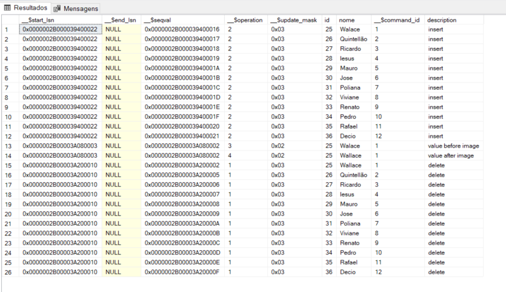

# Change Data Caputure (CDC) With SQL Server 

## About
Essa feature permite rastrear todas as operações de insert, update e delete em uma tabela ou determinada coluna de uma tabela.

## Video
https://youtu.be/DO9nGq3nSAM

## Prerequisites
- Ter permissão para habilitar
- SQL Server precisa estar com o SQL Server Agent ligado

## Warnings
- Não será possível realizar truncate na tabela com CDC
- Se desabilitar o CDC ele apaga a tabela de controle

## Developer
[Wallace Camargo](https://www.linkedin.com/in/wallace-camargo-35b615171/) 

## References

https://learn.microsoft.com/en-us/sql/relational-databases/track-changes/about-change-data-capture-sql-server?view=sql-server-ver16